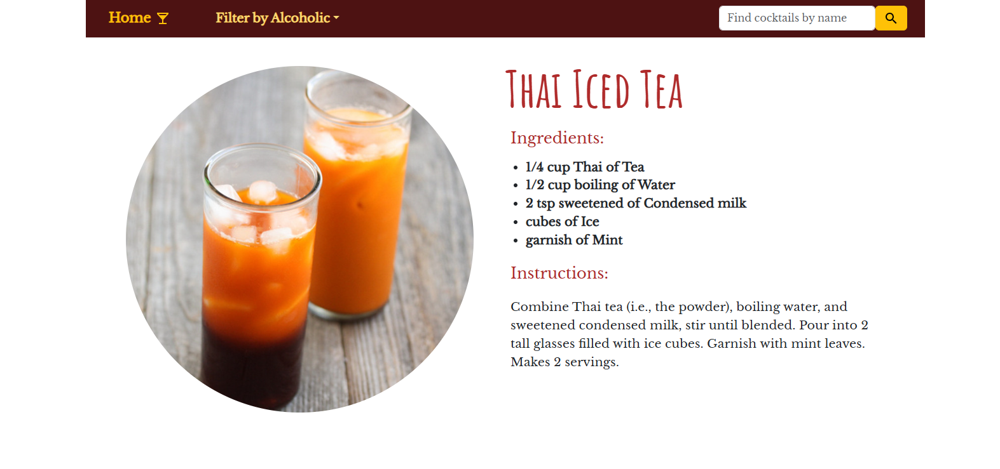
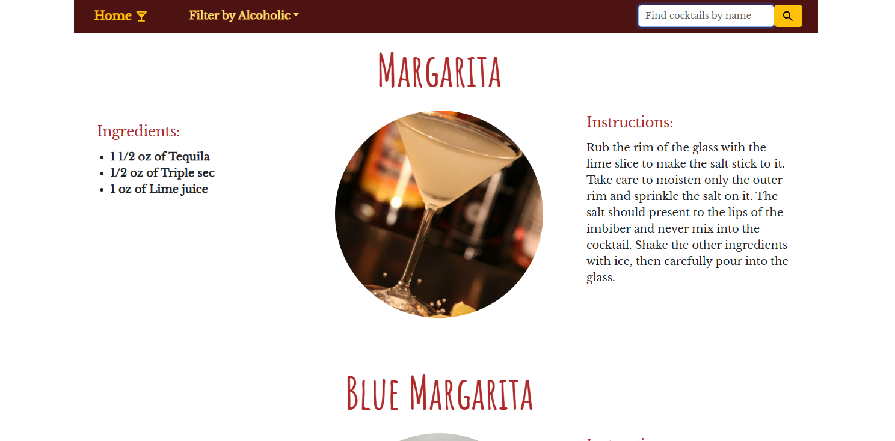
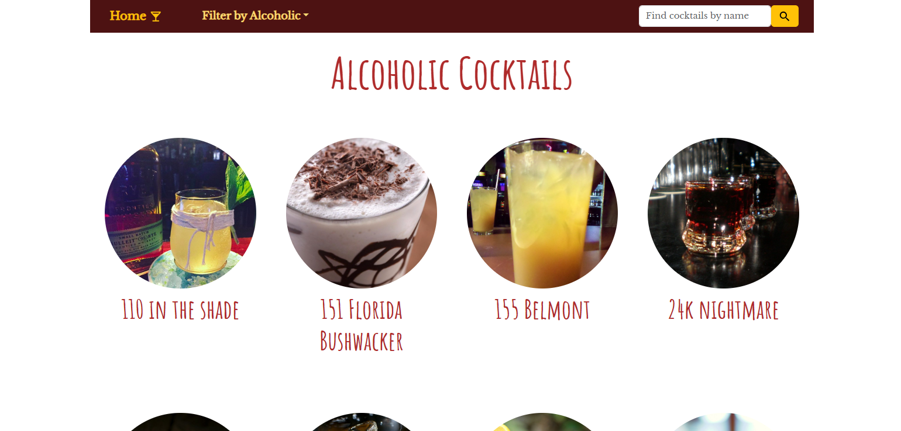
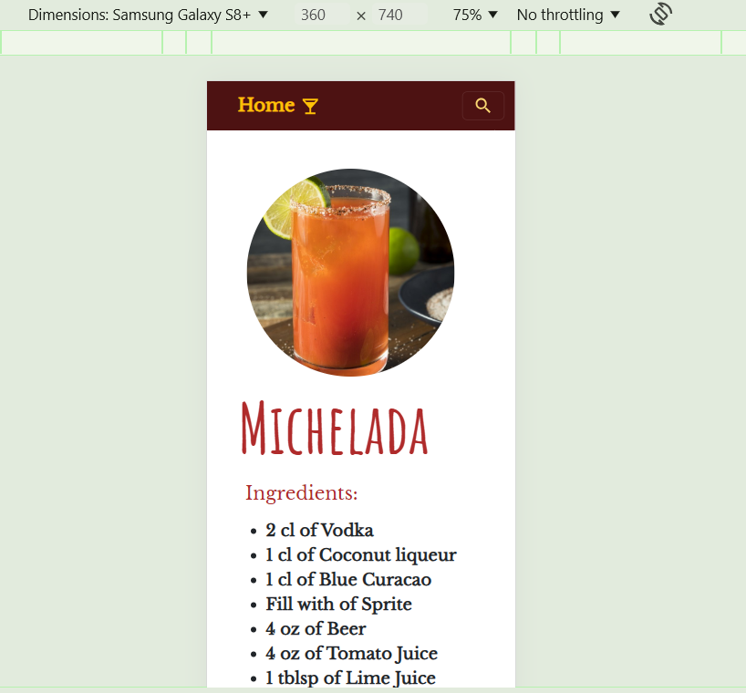

# React Routing REST API Axios Bootsrap cocktails-react Project [visite site](https://rogut-ellena.github.io/cocktails-react/)

## A fully functional cocktails-react project written in React showing how to use REST API

This project is an example that I built using the React, React-routes  and also  Node.js platform, Axios,  REST API, CSS and Bootstrap. Using hooks and params I created the functionality  that routes to different pages and renders different cocktails by its name, id, or alcohol/non-alcohol. 
Every part of this project is sample code wich has examples of how to do the fallowing:

* Create and use state with useState hook from react
* Use params with useParams hook from react-router-dom
* Run functions with useEfect hook
* Create routes using react-router-dom
* Use icons from Material UI

## How to install this example

1. Clone and rename this project.
2. Open in your code editor.
3. Open a new terminal and run in the project directory `npm install` to install all the dependencies.
4. To view it in your browser run `npm start`, and open [http://localhost:3000/cocktails-react](http://localhost:3000/cocktails-react).

## [Click here to visit the live site of cocktails-react project](https://rogut-ellena.github.io/cocktails-react/)
 
### Here I added some photo of cocktails-react app:

